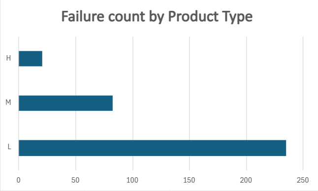
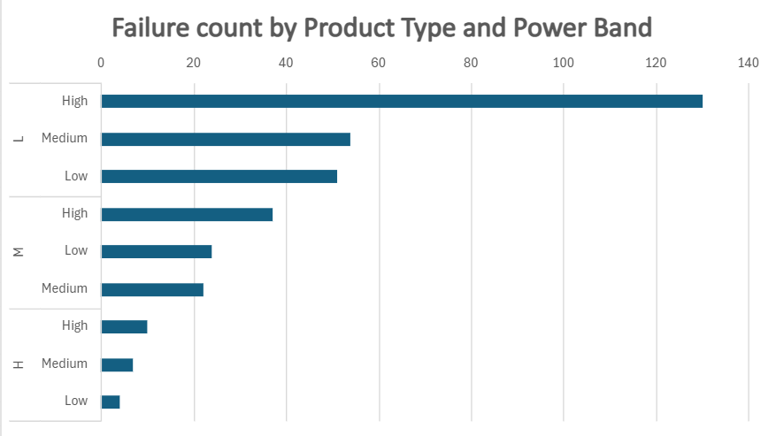
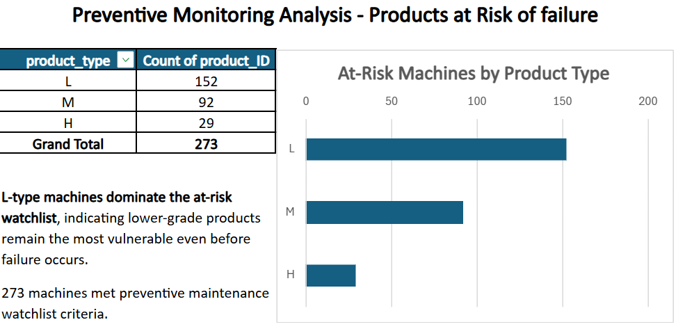

# Project3-sql-predictive-maintenance-failure-analysis
This project applies SQL based data validation to a 10,000 record manufacturing dataset. Drawing on my background in X-ray platform engineering, I analysed the relationship between mechanical load, thermal stress and tool degradation to identify failure precursors.

## Objective
Analyse machine operating conditions and identify factors associated with machine failure.

## Dataset Source
This project uses a synthetic predictive maintenance dataset originally published by the UCI Machine Learning Repository and accessed through Kaggle for analysis practice.

## Dataset characteristics
- 10,000 machine records
- Machine operating conditions (temperature, torque, rotational speed, tool wear)
- Product quality categories (L, M, H)
- Binary failure target
- Failure categories

## Tools Used
- DB browser for SQLite
- Excel for visualization

## Skills used
- SELECT
- WHERE
- GROUP BY
- ORDER BY
- CASE WHEN
- Aggregate Functions

## Sample output

## Key findings
- Out of 10,000 records, only 339 failures occurred (3.39%), indicating a highly imbalanced dataset.
- Type L machines recorded the highest failure count and failure percentage, suggesting lower durability under operating stress.
- Failed machines showed substantially higher tool wear, indicating wear accumulation as a strong early failure signal.
- Torque and estimated mechanical power were stronger failure indicators than temperature variables, with failure risk increasing sharply under high-load conditions.
- Type L machines under high power showed the highest failure probability (17.38%), and also dominated the preventive maintenance watchlist.
